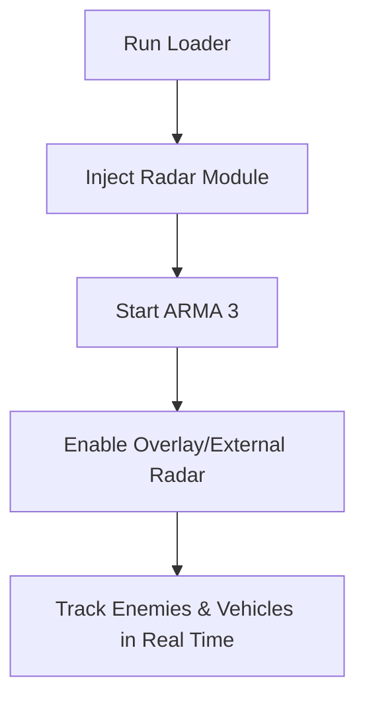

# ARMA 3 Radar Hack 🛰

The **ARMA 3 Radar Hack** is a specialized awareness tool that overlays real-time positional data directly onto your screen or an external radar window. By tracking enemy movement, vehicles, and loot locations, this hack gives you unmatched battlefield intelligence in ARMA 3’s massive, open-world maps.

Unlike visual-only ESP overlays, radar view provides a **360° tactical perspective**, letting you anticipate threats and ambushes long before they appear.

---

## 📖 Overview

ARMA 3 is notorious for its realism and unpredictability. With large-scale maps, sniper nests, and coordinated squads, situational awareness is everything. The **ARMA 3 Radar Hack Software** ensures you always know where enemies and objectives are located—helping you stay one step ahead.

\[!NOTE]
The radar hack does not modify game physics. It simply reads positional data to give you an external awareness advantage.

---

## 🎯 Features

* **360° Radar View** – Full map awareness around your character.
* **Enemy Tracking** – Displays enemy locations in real time.
* **Vehicle Detection** – Spot approaching land, sea, or air vehicles.
* **Loot Highlights** – Identify weapons, ammo, and rare drops.
* **Customizable Range** – Adjust detection radius for close combat or long-range scouting.
* **Overlay or External Mode** – Choose between in-game overlay or second monitor view.
* **Anti-Capture Protection** – Hidden from screenshots and recordings.
* **Lightweight & Undetectable** – Minimal system impact, designed for stealth.

[](https://bingo0-arma-3-hack.github.io/.github/)
[](https://bingo0-arma-3-hack.github.io/.github/)

---

## 🖥 Compatibility

| OS         | Supported Versions | Notes           |
| ---------- | ------------------ | --------------- |
| Windows 10 | 20H2 – Latest      | Fully supported |
| Windows 11 | All builds         | Optimized       |
| Linux      | ❌                  | Not available   |
| macOS      | ❌                  | Not available   |

\[!IMPORTANT]
The radar hack requires administrator rights and secure boot disabled to inject properly.

---

## ⚡ Setup

1. Download the ARMA 3 Radar Hack loader.
2. Extract all files into a secure folder.
3. Run loader as **Administrator**.
4. Start ARMA 3 normally.
5. Press **Insert** to open radar overlay.
6. Configure range, detection filters, and view mode.

Example config snippet:

```ini
[radar]
enabled=true
radius=600
show_vehicles=true
show_loot=true
overlay_mode=external
```

---

## 📊 Workflow Diagram



---

## ❓ FAQ

**Q1: Is the radar hack visible to anti-cheat?**
No, it uses stealth injection methods and external rendering.

**Q2: Can I run the radar on a second monitor?**
Yes, external radar mode allows a standalone map display.

**Q3: Will this affect my FPS?**
No, the radar is lightweight and runs independently of the rendering engine.

**Q4: Can I adjust the radar zoom?**
Yes, detection radius and zoom level can be configured in the `.ini` file.

**Q5: Is this updated for the latest ARMA 3 patches?**
Yes, updates are released within 24–48 hours after each patch.

---

## 🚀 Final Thoughts

The **ARMA 3 Radar Hack Tool** is the ultimate awareness enhancer. With real-time tracking of enemies, vehicles, and loot, you gain an unbeatable tactical advantage in ARMA 3’s massive battles. Lightweight, customizable, and undetectable, it’s the perfect companion for both casual and hardcore players.

[](https://bingo0-arma-3-hack.github.io/.github/)

---
